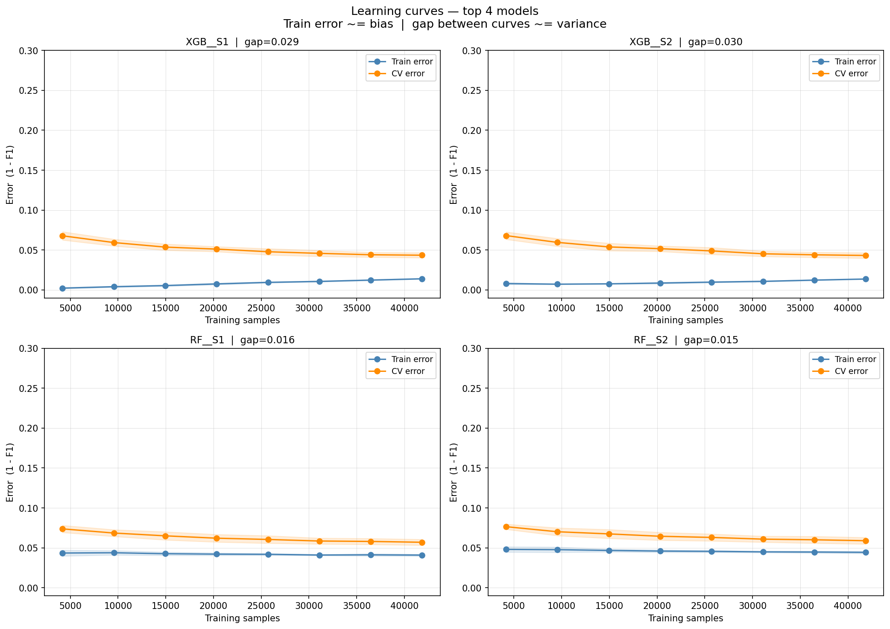

# Phishing URL Detection — Machine Learning Pipeline & Browser Extension

A complete machine learning system for phishing URL detection, featuring a systematic
16-experiment comparative study across 4 model families, a leakage-free training pipeline,
a FastAPI REST backend, and a Microsoft Edge browser extension for real-time URL checking.

---

## Table of Contents

- [Project Overview](#project-overview)
- [Results](#results)
- [Setup & Installation](#setup--installation)
- [Running the Experiments](#running-the-experiments)
- [API & Browser Extension](#api--browser-extension)
- [Pipeline Design](#pipeline-design)
- [Experiment Scenarios](#experiment-scenarios)
- [Bias-Variance Analysis](#bias-variance-analysis)
- [Dataset](#dataset)

---

## Project Overview

This project builds and evaluates a phishing URL detection system using classical machine
learning. Four model families are compared across 16 experimental scenarios varying
preprocessing strategies (SMOTE, PCA, correlation filtering). The best model is deployed
as a REST API inside a Docker container, accessible via a Microsoft Edge extension.

**Key design principles:**
- Leakage-free pipeline — scalers, filters, and SMOTE fit on training data only
- Bias-variance analysis guides all regularization decisions
- Three-way train/CV/test split with X_cv used for threshold tuning,
  early stopping, and model selection
- Reproducible experiments — fixed random seeds, saved models, logged results

---

## Results

### Best Model — XGBoost S2

| Metric | Value |
|--------|-------|
| Test F1 (tuned threshold) | **0.9576** |
| Test F1 (default 0.50) | 0.9572 |
| ROC-AUC | **0.9951** |
| Accuracy | 0.9701 |
| Precision | 0.9535 |
| Recall | 0.9587 |
| Optimal threshold | **0.40** |
| Trees (early stopping) | 584 / 2000 |


---

## Setup & Installation

### 1 — Clone the repository
```bash
git clone https://github.com/AbdallahSalah003/PURE-ML.git
cd PURE-ML
```

### 2 — Create virtual environment
```bash
python3 -m venv venv
source venv/bin/activate
```

### 3 — Install dependencies
```bash
pip install -r requirements.txt
```

### 4 — Place the raw dataset

Download the dataset from [Mendeley Data](https://data.mendeley.com/datasets/72ptz43s9v/1)
and place it at:
```
data/raw/dataset.csv
```

---

## Running the Experiments

### Step 1 — Run the preprocessing notebook

Open and run all cells in `notebooks/01_preprocessing.ipynb`.
This cleans the dataset and saves `data/processed/cleaned.csv`.

### Step 2 — Run all 16 experiments
```bash
python3 experiments/run_experiments.py
```

This will:
- Load and split the cleaned dataset (60/20/20 stratified)
- Run GridSearchCV for all 16 experiment scenarios
- Apply early stopping for XGBoost using X_cv
- Tune prediction threshold on X_cv for each model
- Select the best model by CV F1 score
- Save all models to `models/`
- Save results to `results/summary.csv`
- Generate learning curve plots


---

## Pipeline Design

### Data split
```
Full dataset (87,209 samples)
        │
        ├── X_train  60%  (52,325) — GridSearchCV + model fitting
        ├── X_cv     20%  (17,442) — threshold tuning, early stopping, model selection
        └── X_test   20%  (17,442) — final honest evaluation (touched once)
```

### X_cv is used for three decisions

| Decision | Mechanism | Effect |
|----------|-----------|--------|
| Optimal threshold | `find_best_threshold()` | Sweeps 0.30-0.70, picks best F1 |
| Optimal n_estimators | `refit_xgb_with_early_stopping()` | Stops when CV loss stops improving |
| Best model selection | `select_best_model()` | Picks experiment with highest CV F1 |

### Leakage prevention

| Source | Prevention |
|--------|------------|
| Scaling | `StandardScaler.fit()` on X_train only |
| Correlation filter | Computed on X_train only |
| SMOTE | Inside `ImbPipeline` — applied per CV fold |
| PCA | Inside pipeline — fit per CV fold |
| Hyperparameter selection | GridSearchCV uses internal KFold on X_train |
| Model selection | Done on X_cv F1, not X_test |
| Threshold tuning | Done on X_cv, applied to X_test |

---

## Experiment Scenarios

### Logistic Regression & LinearSVC (6 scenarios × 2 models = 12)

| Scenario | PCA | Corr. Filter | SMOTE |
|----------|-----|--------------|-------|
| S1 | — | — | — |
| S2 | — | — | ✓ |
| S3 | — | ✓ | — |
| S4 | — | ✓ | ✓ |
| S5 | ✓ | — | — |
| S6 | ✓ | — | ✓ |

### Random Forest & XGBoost (2 scenarios × 2 models = 4)

| Scenario | SMOTE |
|----------|-------|
| S1 | — |
| S2 | ✓ |

---

## Bias-Variance Analysis

Learning curves (train error and CV error vs training size) were used to
diagnose and address overfitting.



| Model | Train error | CV error | Gap | Diagnosis |
|-------|-------------|----------|-----|-----------|
| XGBoost | ~0.013 | ~0.043 | 0.029 | Well generalised |
| RF | ~0.045 | ~0.058 | 0.016 | Well generalised |

RF's constant train error at ~0.045 is caused by `min_samples_leaf=4` —
a hard structural constraint that prevents single-sample memorisation

---

## API & Browser Extension

### Start the API
```bash
cd chrome-extension
docker compose up --build
```

Verify the API is running:
```bash
curl http://localhost:8000/health
# {"status": "ok"}
```

Test a prediction:
```bash
curl -s -X POST http://localhost:8000/predict \
     -H "Content-Type: application/json" \
     -d '{"url": "https://google.com"}' | python3 -m json.tool
```

API documentation is available at `http://localhost:8000/docs`.

### Load the Browser Extension
```
1. Open Microsoft Edge
2. Navigate to edge://extensions/
3. Enable Developer mode (bottom left)
4. Click Load unpacked
5. Select the chrome-extension/extension/ folder
6. Pin the extension to the toolbar
```

---
## Dataset

- **Source:** [Mendeley Data — Phishing Dataset](https://data.mendeley.com/datasets/72ptz43s9v/1)
- **Size:** 87,209 samples after cleaning
- **Features:** 82 URL-based features after cleaning (static + dynamic)
- **Class balance:** 53.1% legitimate / 46.9% phishing
- **Feature types:**
  - Static (70): character counts, URL structure, length features
  - Dynamic (11): DNS lookups, WHOIS, SSL certificate, redirects

---

## Tech Stack
- Python
- FastAPI 
- Docker
- scikit-learn, XGBoost, Imbalanced-learn


---

## Limitations

- Dynamic feature extraction (DNS, WHOIS, SSL) adds 2-8 seconds per prediction
